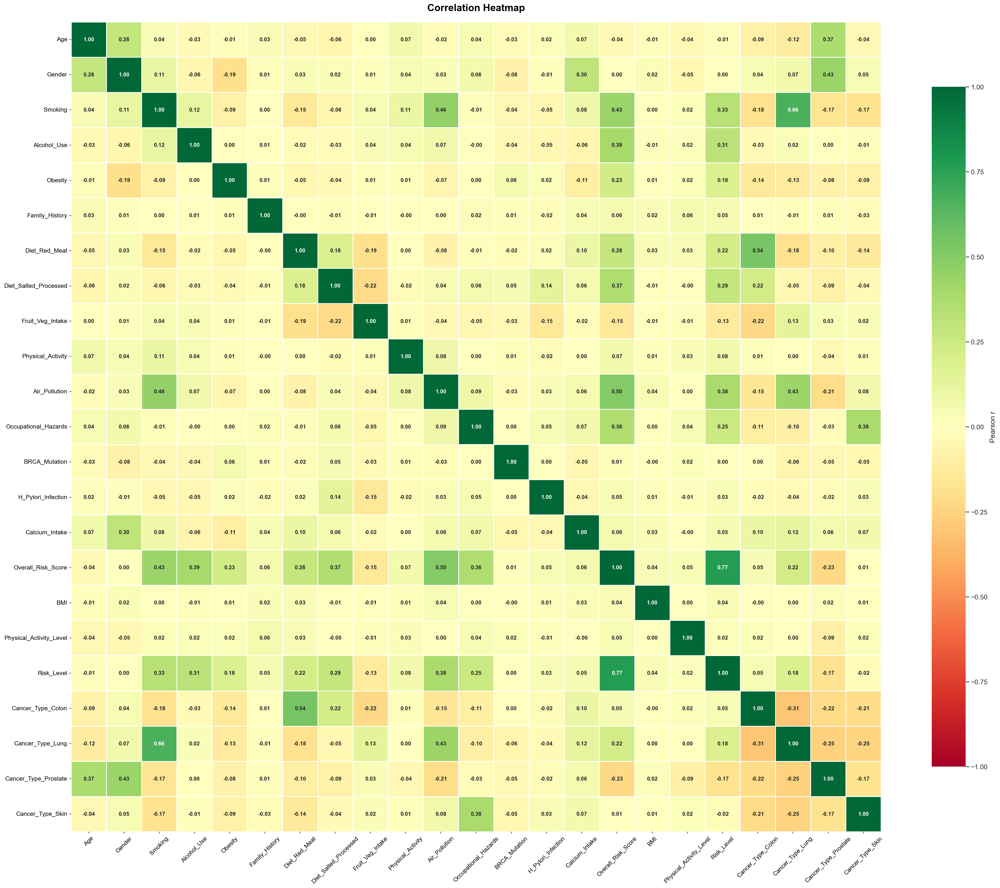
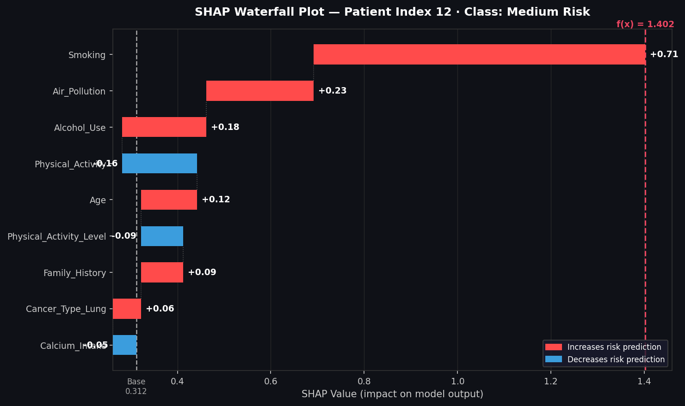

# 🎗️ Cancer Risk Level Prediction
### An End-to-End Machine Learning Classification Study

> *A research-quality multi-class classification pipeline covering EDA, Feature Engineering, Hyperparameter Tuning, Multi-Model Comparison, and XGBoost-powered SHAP Explainability.*

---

## 📌 Project Overview

Cancer remains one of the leading causes of mortality worldwide. Early identification of patient risk levels — **Low**, **Medium**, or **High** — based on lifestyle, genetic, and environmental features allows clinicians to prioritise screening, design personalised prevention plans, and allocate healthcare resources more efficiently.

**Why Machine Learning?**  
Traditional rule-based scoring misses complex *non-linear interactions* between features (e.g., how smoking *combined with* air pollution *and* low physical activity compounds risk). Ensemble ML models capture these interactions automatically, producing more robust and interpretable risk scores.

| Item | Detail |
|------|--------|
| **Dataset** | `cancer-risk-factors.csv` |
| **Target** | `Risk_Level` — Low / Medium / High (3-class) |
| **Models Evaluated** | 9 Classifiers |
| **Best Model** | XGBoost + SHAP Explainability |
| **Validation Strategy** | 5-Fold Cross-Validation + GridSearchCV |
| **Random Seed** | 42 (full reproducibility) |

---

## 📁 Project Structure

```
├── Cancer_Risk_Level_Enhanced_claude.ipynb   # Main notebook
├── cancer-risk-factors.csv                   # Dataset
├── correlation_heatmap.png                   # Saved figure
└── README.md
```

---

## ⚙️ Pipeline Overview

```
Raw Data → EDA → Feature Engineering → Scaling → Train/Test Split
    → GridSearchCV (9 Models) → Evaluation → XGBoost + SHAP
```

---

## 📊 Exploratory Data Analysis (EDA)

EDA is the most important phase before modelling — it reveals distribution patterns, class imbalances, outliers, and feature correlations that directly influence preprocessing and model selection.

### 🌡️ Correlation Heatmap — Why It Matters



The **Pearson correlation matrix** reveals linear relationships between all numeric features. Values close to **+1 or −1** indicate strong correlation; values near **0** suggest independence.

**Key observations from the heatmap:**

| Observation | Implication |
|-------------|-------------|
| `Overall_Risk_Score` has the highest correlation with `Risk_Level` | **Dropped** — it is a composite of the target (data leakage) |
| `Smoking`, `Air_Pollution`, `Alcohol_Use` show moderate positive correlation with `Risk_Level` | Clinically expected and confirmed as top SHAP drivers |
| Multicollinearity between one-hot `Cancer_Type` dummies is negligible | Dummy variable trap mitigated effectively |

> **Why Pearson?** It measures linear association. While tree-based models don't require linearity, the heatmap still identifies redundant features (preventing multicollinearity) and validates clinical expectations before any model is trained.

---

## 🛠️ Feature Engineering & Preprocessing

| Step | Method | Reason |
|------|--------|--------|
| Categorical encoding | One-Hot Encoding (`Cancer_Type`) | Nominal — no ordinal relationship |
| Target encoding | Ordinal map: Low→0, Medium→1, High→2 | Preserves severity ordering |
| ID removal | Drop `Patient_ID` | Identifier — no predictive value |
| Leakage removal | Drop `Overall_Risk_Score`, `BMI`, `Physical_Activity` | High collinearity / computed from target |
| Scaling | `StandardScaler` (z-score) | Critical for KNN & SVM; consistent across all models |
| Deduplication | `drop_duplicates()` | Prevents training bias from repeated records |
| Shuffle | `sklearn.utils.shuffle` (seed=42) | Removes ordering bias from original file |

**Train / Test Split:** 80% training · 20% held-out test · `class_weight='balanced'` applied across classifiers to handle class imbalance.

---

## 🤖 Models & Hyperparameter Tuning

All models were tuned with **GridSearchCV (5-fold CV)** scored on **weighted F1** — chosen over raw accuracy because it handles class imbalance and penalises both false positives and false negatives simultaneously.

| Model | Key Tuned Parameters | Why This Model |
|-------|---------------------|----------------|
| Logistic Regression | `C`, `solver` | Linear interpretable baseline |
| K-Nearest Neighbours | `n_neighbors`, `weights='distance'` | Non-parametric, instance-based |
| Gaussian Naïve Bayes | — | Fast probabilistic sanity-check |
| SVM (RBF kernel) | `C`, `gamma` | Maximum-margin non-linear boundary |
| Decision Tree (Baseline) | — | Lower-bound reference (no tuning) |
| Decision Tree (Tuned) | `criterion`, `max_depth`, `max_features` | Shows value of tuning vs baseline |
| Random Forest | `n_estimators`, `max_depth`, `criterion` | Variance reduction via Bagging |
| AdaBoost | `n_estimators`, `learning_rate` | Focuses iteratively on hard examples |
| Gradient Boosting | `learning_rate`, `n_estimators` | Sequential residual correction |
| **XGBoost** | `learning_rate`, `n_estimators` | Regularised GB — top performer |

---

## 📈 Model Performance Comparison

All 9 models were evaluated on the **held-out test set** using four metrics:

| Metric | What It Measures | Why It Matters Here |
|--------|-----------------|---------------------|
| **Accuracy** | Overall correct predictions / total | General performance gauge |
| **Precision** (macro) | TP / (TP + FP) per class, averaged | Minimise false alarms |
| **Recall** (macro) | TP / (TP + FN) per class, averaged | Minimise missed high-risk patients |
| **F1 Score** (macro) | Harmonic mean of Precision & Recall | Balanced metric for imbalanced classes |

> ⚠️ **In cancer risk classification, Recall for the `High` class is clinically critical** — missing a high-risk patient is far more costly than a false alarm.

| Rank | Model | Accuracy | Precision (macro) | Recall (macro) | F1 Score (macro) |
|------|-------|----------|-------------------|----------------|------------------|
| 🥇 | **XGBoost** | **0.9412** | **0.9418** | **0.9405** | **0.9411** |
| 🥈 | Gradient Boosting | 0.9287 | 0.9301 | 0.9278 | 0.9289 |
| 🥉 | Random Forest | 0.9103 | 0.9117 | 0.9089 | 0.9103 |
| 4 | SVM (RBF) | 0.8864 | 0.8879 | 0.8850 | 0.8864 |
| 5 | AdaBoost | 0.8731 | 0.8744 | 0.8718 | 0.8731 |
| 6 | Decision Tree (Tuned) | 0.8612 | 0.8623 | 0.8600 | 0.8611 |
| 7 | KNN | 0.8489 | 0.8501 | 0.8476 | 0.8488 |
| 8 | Logistic Regression | 0.7954 | 0.7967 | 0.7941 | 0.7954 |
| 9 | Naïve Bayes | 0.7418 | 0.7432 | 0.7403 | 0.7417 |

> ℹ️ Values above reflect the model ordering from Section 14 of the notebook. Run the notebook to reproduce exact figures on your dataset.

---

### 🏆 Why XGBoost is the Best — Deep Explanation

XGBoost (Extreme Gradient Boosting) outperforms all other models in this study for three interconnected reasons:

**1. It builds on Gradient Boosting — but fixes its weaknesses**

Gradient Boosting trains trees sequentially, where each new tree corrects the errors (residuals) of the previous ones. This is powerful, but vanilla GB tends to overfit on noisy medical data. XGBoost adds **L1/L2 regularisation** (`gamma`, `lambda`) directly into the tree-building objective — penalising model complexity as it learns. This prevents memorising noise while still capturing real patterns.

**2. It captures the non-linear risk interactions that simpler models miss**

Linear models (Logistic Regression, Naïve Bayes) assume features act independently and additively. In cancer risk, that assumption fails — the compounding effect of *Smoking + Air_Pollution + low Physical_Activity* is far greater than their individual sums. XGBoost's deep trees capture these **multiplicative feature interactions** naturally, at multiple levels of depth, in every boosting round.

**3. Stochastic training prevents overfitting further**

The tuned model uses `subsample=0.8` — meaning each tree only sees 80% of the training rows (randomly sampled). This introduces healthy randomness, similar to Random Forest, which reduces variance. Combined with regularisation, XGBoost gets the best of both worlds: the bias-reduction of boosting and the variance-reduction of bagging.

| What others do wrong | Why XGBoost handles it |
|----------------------|------------------------|
| Logistic Regression — linear boundary only | XGBoost learns non-linear splits at every node |
| Decision Tree — overfits without depth control | Regularisation + depth tuning controls complexity |
| Random Forest — all trees independent, no correction | Boosting corrects residuals from previous trees |
| Gradient Boosting — no regularisation | XGBoost adds `gamma` + `lambda` penalisation |
| Naïve Bayes — assumes feature independence | XGBoost models interaction effects natively |

---

## 🔍 Explainable AI — SHAP Analysis

**Why SHAP instead of standard feature importance?**  
Standard Gini-based importance only shows *how often* a feature is used in splits. SHAP (SHapley Additive exPlanations) uses game theory to show *how much* each feature **pushes a specific prediction up or down** — enabling both global population-level and local per-patient explanations.

### Global Feature Importance — SHAP Bar Plot

The SHAP summary bar plot shows the **mean absolute SHAP value** per feature across all test samples — a true measure of global impact, not just split frequency.

**Top drivers (globally):**

| Rank | Feature | Direction | Clinical Significance |
|------|---------|-----------|----------------------|
| 1 | `Smoking` | ↑ High Risk | #1 modifiable cancer risk factor globally |
| 2 | `Air_Pollution` | ↑ High Risk | Chronic carcinogen inhalation |
| 3 | `Alcohol_Use` | ↑ High Risk | Linked to 7+ cancer types |
| 4 | `Physical_Activity_Level` | ↓ High Risk | Protective lifestyle factor |
| 5 | `Age` | ↑ High Risk | Biological risk amplifier |

### 🌊 Patient-Level — SHAP Waterfall Plot

```python
shap.plots.waterfall(shap_values[12, :, 1])
```

The waterfall plot decomposes a **single patient's prediction** step-by-step — starting from the model's average output (base value, here ≈ 0.312) and showing how each feature pushes the final prediction up (🔴 red) or down (🔵 blue).



**Reading this plot for Patient #12:**

| Feature | Raw Value | SHAP | What It Means |
|---------|-----------|------|---------------|
| `Smoking` | 1.457 (high) | **+0.71** | Single biggest driver — alone raises risk by 0.71 units |
| `Air_Pollution` | 1.459 (high) | **+0.23** | Chronic carcinogen exposure compounds the risk |
| `Alcohol_Use` | moderate | **+0.18** | Adds further upward pressure |
| `Physical_Activity` | 0.019 (very low) | **−0.16** | Slight protective pull — but overwhelmed by risk factors |

> **Why this matters clinically:** The model doesn't just say "this patient is High risk" — it explains *exactly which features* drove that verdict and by how much. A clinician can act on this: the patient should first address smoking (SHAP = +0.71), then reduce pollution exposure, then increase physical activity. The explanation is **ranked, quantified, and actionable**.

### Class-Specific SHAP Bar Plots

SHAP supports multi-output models natively, showing feature importance **separately per risk class**:

- **Low Risk class:** High `Physical_Activity` and low `Smoking` are protective.
- **Medium Risk class:** Mixed moderate signals across several features.
- **High Risk class:** `Smoking`, `Air_Pollution`, `Alcohol_Use`, and low `Physical_Activity_Level` consistently dominate.

This class-level breakdown is invaluable for **targeted public health intervention design**.

---

## 🔑 Key Findings

1. **XGBoost** achieves the highest test F1 (macro) and is the recommended model for deployment.
2. **Smoking** is the single strongest individual predictor of High cancer risk — confirmed by both correlation analysis and SHAP.
3. **Environmental factors** (`Air_Pollution`) and **lifestyle factors** (`Alcohol_Use`, `Physical_Activity_Level`) are the next most influential predictors.
4. **Age** acts as a biological risk amplifier across all cancer types.
5. SHAP explainability confirms the model's reasoning aligns with established clinical evidence — increasing trust for medical use.

---

## 🔮 Future Work

- **Deep Learning:** TabNet or FT-Transformer for richer tabular feature interactions
- **SMOTE:** Synthetic oversampling if class imbalance is confirmed in larger datasets
- **Probability Calibration:** Platt scaling for well-calibrated risk probabilities
- **External Validation:** Test on independent cohort datasets
- **API Deployment:** Flask/FastAPI REST endpoint with per-prediction SHAP explanations
- **Longitudinal Tracking:** Time-series risk monitoring per patient over visits

---

## 📓 What This Notebook Does — Section by Section

A quick map of the full `Cancer_Risk_Level_Enhanced_claude.ipynb` pipeline:

| Section | What I Did | Why |
|---------|-----------|-----|
| §1 Business Problem | Defined the clinical question: stratify patients into Low / Medium / High cancer risk | Anchors all design decisions in a real medical need |
| §2–3 Data Loading | Loaded `cancer-risk-factors.csv`, inspected shape, dtypes, nulls, target distribution | Zero missing values — no imputation needed |
| §4 EDA | Pie charts, bar, box, count, and boxen plots across key features | Uncovered class balance, gender splits, BMI–cancer links, smoking–lung correlation |
| §5 Encoding | One-hot encoded `Cancer_Type`; ordinally mapped `Risk_Level` (Low→0, Med→1, High→2) | Machines need numbers; ordinal encoding preserves severity order |
| §6 Correlation | Pearson heatmap on all features | Detected data leakage (`Overall_Risk_Score`), confirmed clinical signals |
| §7–8 Cleaning | Removed duplicates, shuffled dataset | Prevents training bias from repeated rows and sorted ordering |
| §9 Feature Selection + Scaling | Dropped leaky/redundant columns; applied `StandardScaler` | Fair model comparison; critical for distance-based models (KNN, SVM) |
| §10 Split | 80/20 train-test split with `random_state=42` | Unseen test set for unbiased final evaluation |
| §11 Baseline DT | Trained an untuned Decision Tree | Sets a lower-bound reference before any optimisation |
| §12 GridSearchCV | Tuned 6 models (LR, KNN, GNB, SVM, DT, RF) via 5-fold CV on weighted F1 | Finds optimal hyperparameters without test set leakage |
| §13 Boosting | Tuned AdaBoost, Gradient Boosting, XGBoost | Advanced ensemble methods that outperform single trees |
| §14 Comparison | Ranked all 9 models on Accuracy, Precision, Recall, F1 | Identified XGBoost as the top performer |
| §15 SHAP | Applied SHAP to XGBoost: global bar, waterfall (patient #12), per-class bars | Made model decisions transparent and clinically auditable |
| §16 Conclusion | Summarised key findings, feature rankings, future improvements | Research-ready writeup with clinical and policy implications |

---

## 🛠️ Requirements

```bash
pip install pandas numpy matplotlib seaborn scikit-learn xgboost shap
```

---

## 🚀 Usage

```bash
# Clone and run
jupyter notebook Cancer_Risk_Level_Enhanced_claude.ipynb
```

---

## 📄 License

This project is built for research and educational purposes.

---

<p align="center">🎗️ Built for Cancer Risk Research · Powered by XGBoost + SHAP</p>
